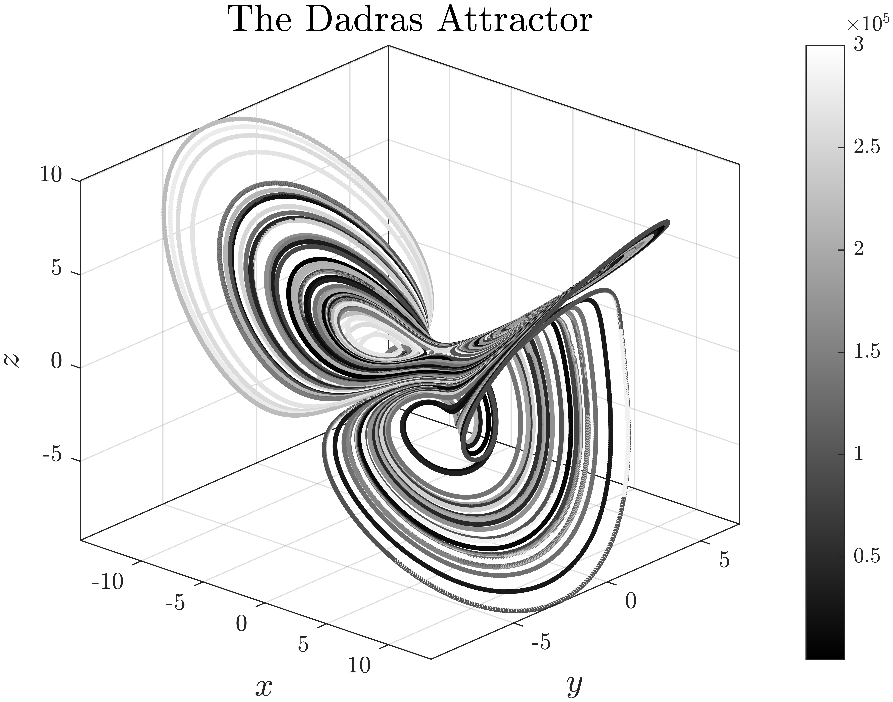
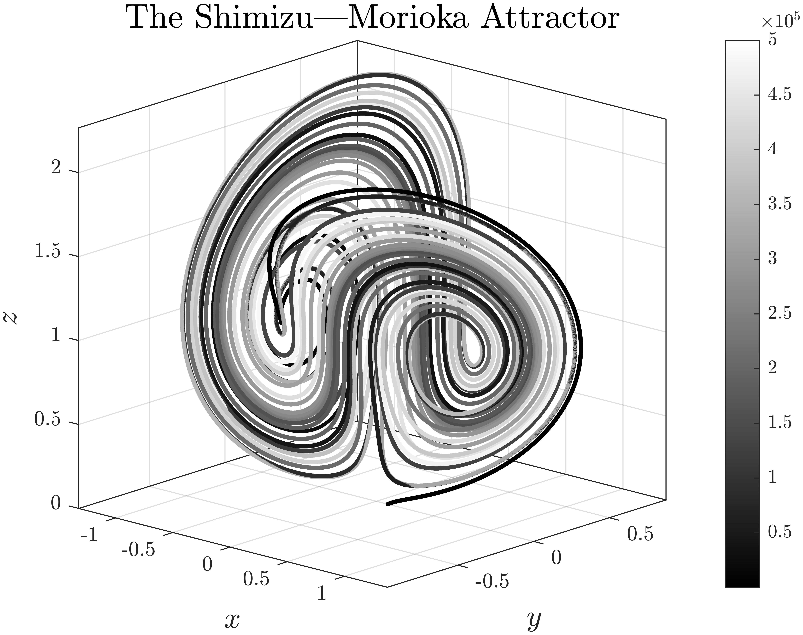
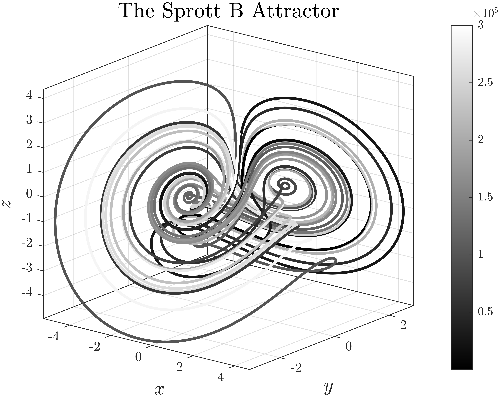
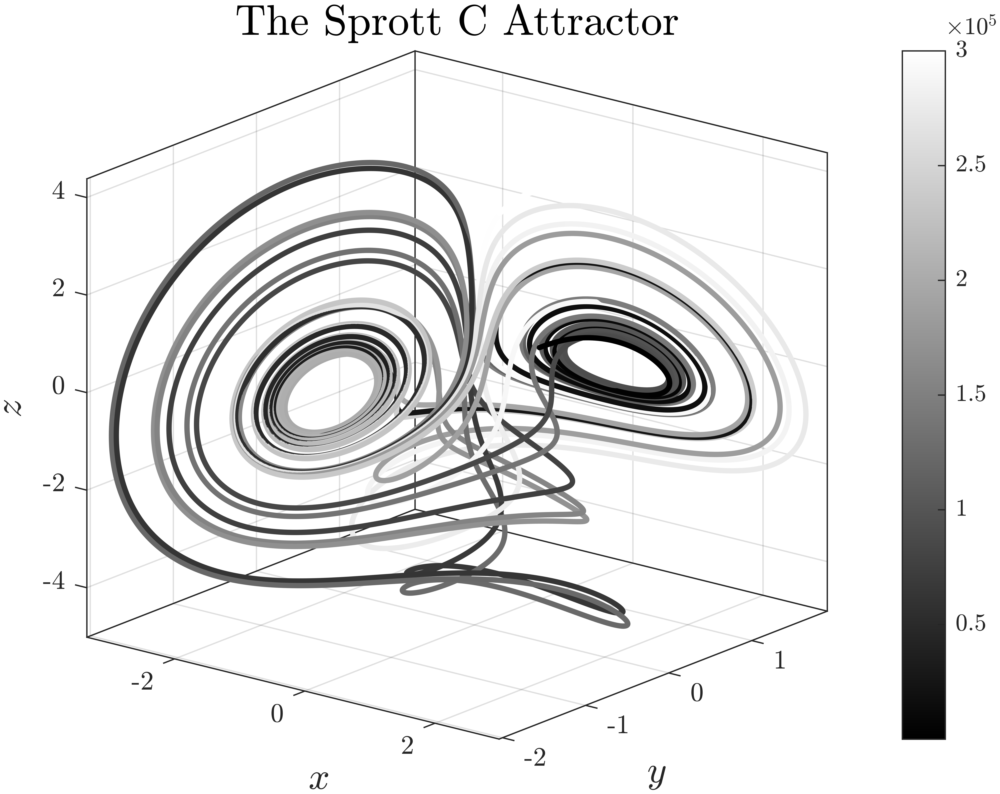
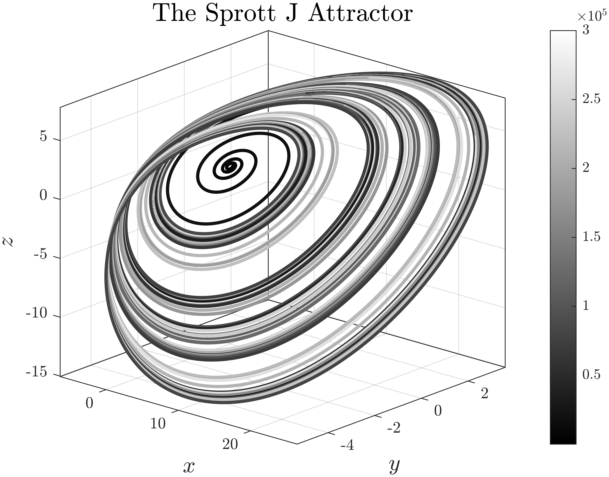
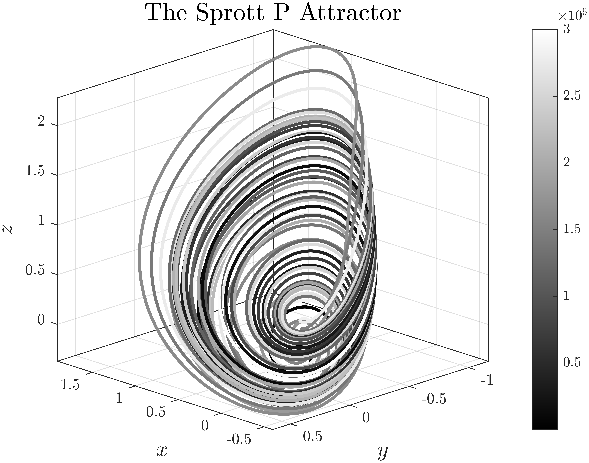
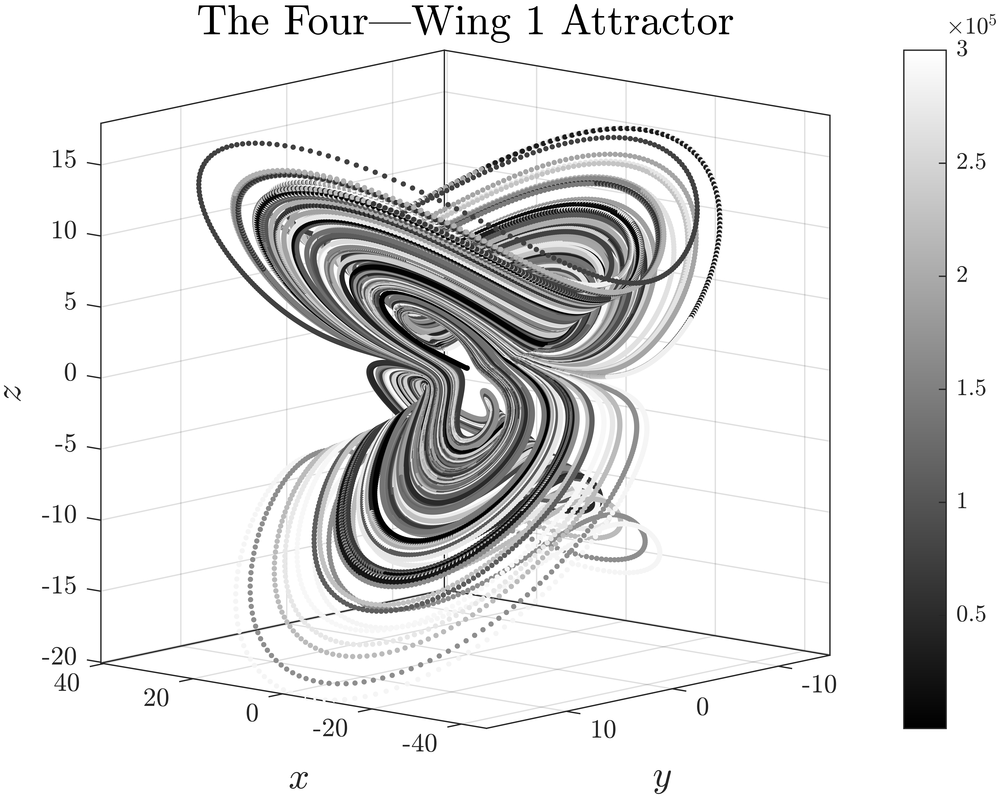
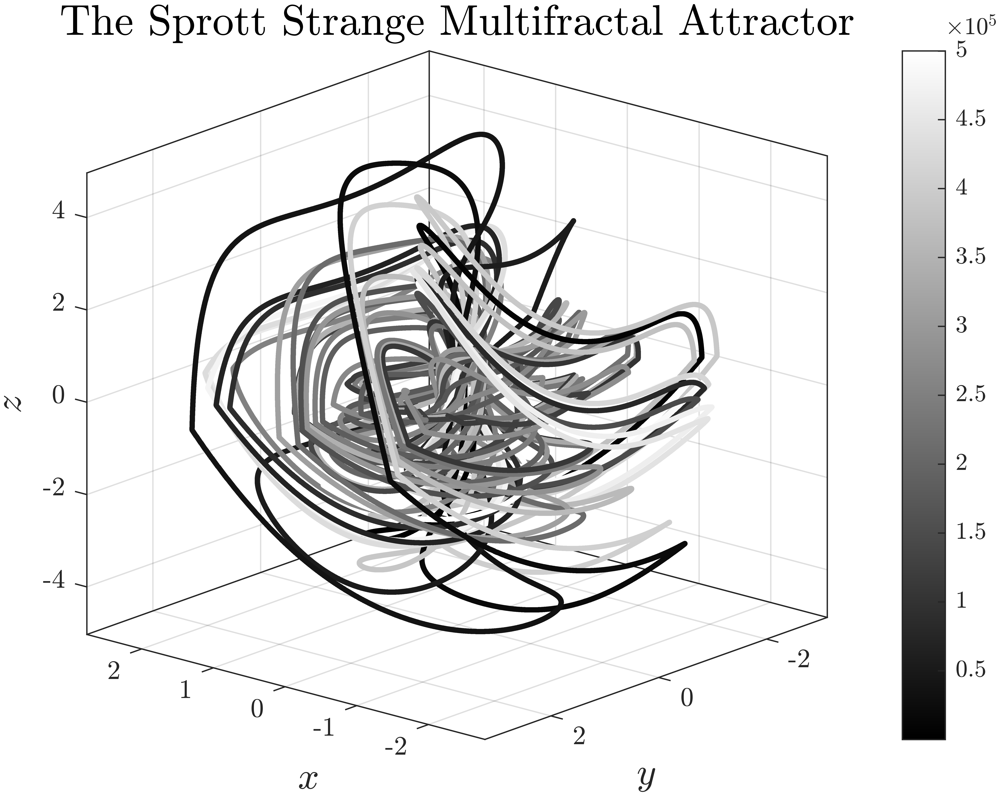
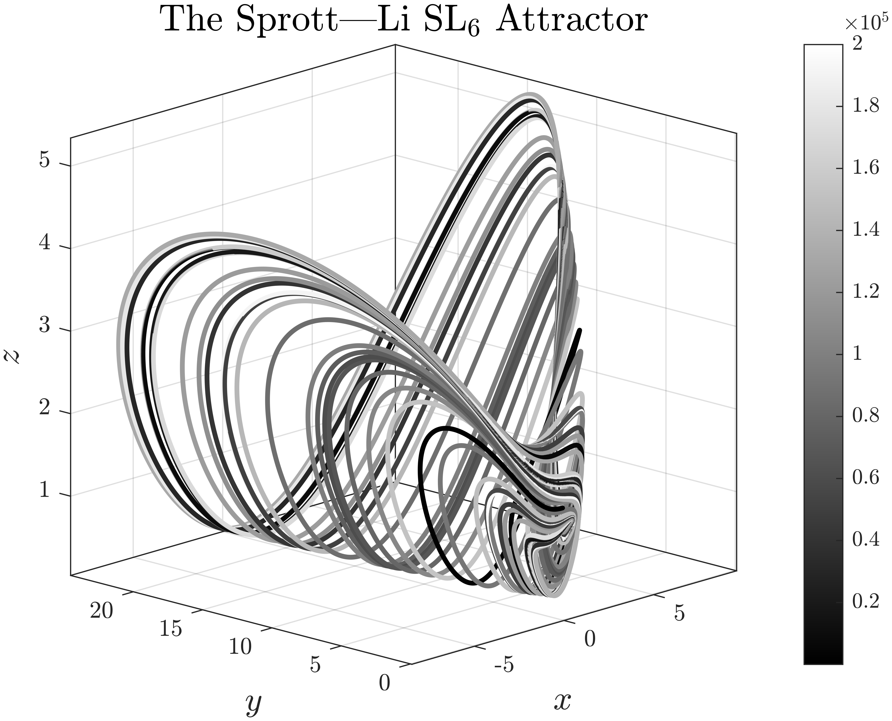

# Dynamics of Nonlinear Attractors

Gallery of more than 100 three-dimensional attractors plotted by me in MATLAB using [explicit Runge—Kutta methods](https://github.com/whydenyscry/General-algorithm-of-the-explicit-Runge-Kutta-method) (in particular, the 4th order Runge—Kutta method).

A fair number of attractors I found on [Jürgen Mayer's personal website](http://www.3d-meier.de/), you can find references to primary sources there, so if some attractors lack references, those attractors were found there.
For attractors that have been found already by me, I will leave a reference to the primary source. 

A gallery of high-dimensional hyperchaotic attractors will be in the [Dynamics of Hyperchaotic Attractors](https://github.com/whydenyscry/Dynamics-of-Hyperchaotic-Attractors) repository.

The plots are also available on Pinterest and Behance:

P.S. _I give the title of attractors as the surnames of the authors of the paper where the attractor was found. For papers with a large number of authors, I take only the first 3 surnames._

**NOTE:** This repository has reached its limit in displaying math formulas, so the continuation of the gallery can be seen in the new repository [Dynamics of Chaotic Attractors](https://github.com/whydenyscry/Dynamics-of-Chaotic-Attractors).

## The Lorenz Attractor
 
 $$ 
\begin{cases}
    \frac{\mathrm{d}x}{\mathrm{d}t} = \sigma(y - x), \\
    \frac{\mathrm{d}y}{\mathrm{d}t} = x(\rho - z) - y, \\
    \frac{\mathrm{d}z}{\mathrm{d}t} = xy - \beta z,
\end{cases}
 $$
 
$$
 \begin{bmatrix}
			\sigma\\
			\rho\\
			\beta
\end{bmatrix} = \begin{bmatrix}
		10 \\ 
		28 \\ 
		\frac{8}{3}
	\end{bmatrix}.
$$

  

## The Lorenz Mod 1 Attractor
 
$$ 
\begin{cases}
			\frac{\mathrm{d}x}{\mathrm{d}t}=-\alpha x+y^2-z^2+\alpha\varsigma, \\
			\frac{\mathrm{d}y}{\mathrm{d}t}=x\left(y-\beta z\right)+\delta, \\
			\frac{\mathrm{d}z}{\mathrm{d}t}=-z+x\left(\beta y+z\right),
		\end{cases}
$$
 
$$
\begin{bmatrix}
			\alpha\\
			\beta\\
			\varsigma\\
			\delta
		\end{bmatrix}=
		\begin{bmatrix}
			0.1\\
			4\\
			14\\
			0.08
		\end{bmatrix}.
$$

  

## The Lorenz Mod 2 Attractor
 
$$ 
\begin{cases}
			\frac{\mathrm{d}x}{\mathrm{d}t}=-\alpha x+y^2-z^2+\alpha\varsigma, \\
			\frac{\mathrm{d}y}{\mathrm{d}t}=x\left(y-\beta z\right)+\delta, \\
			\frac{\mathrm{d}z}{\mathrm{d}t}=-z+x\left(\beta y+z\right),
		\end{cases}
$$
 
$$
\begin{bmatrix}
			\alpha\\
			\beta\\
			\varsigma\\
			\delta
		\end{bmatrix}=
		\begin{bmatrix}
			0.9\\
			5\\
			9.9\\
			1
		\end{bmatrix}.
$$

  

## The Lotka—Volterra Attractor
 
$$ 
\begin{cases}
			\frac{\mathrm{d}x}{\mathrm{d}t}=x-xy+\varsigma x^2-\alpha z x^2, \\
			\frac{\mathrm{d}y}{\mathrm{d}t}=-y+xy, \\
			\frac{\mathrm{d}z}{\mathrm{d}t}=-\beta z +\alpha z x^2,
\end{cases}
$$
 
$$
\begin{bmatrix}
			\alpha\\
			\beta\\
			\varsigma
\end{bmatrix}=
		\begin{bmatrix}
			2.9851\\
			3\\
			2
\end{bmatrix}.
$$

  

## The Aizawa Attractor
 
$$ 
\begin{cases}
			\frac{\mathrm{d}x}{\mathrm{d}t} = (z - \beta)x - \delta y, \\
			\frac{\mathrm{d}y}{\mathrm{d}t} = \delta x + (z - \beta)y, \\
			\frac{\mathrm{d}z}{\mathrm{d}t} = \varsigma + \alpha z - \frac{z^3}{3} - \left(x^2 + y^2\right)\left(1 + \varepsilon z\right) + \xi zx^3,
\end{cases}
$$
 
$$
\begin{bmatrix}
			\alpha \\
			\beta \\
			\varsigma \\
			\delta \\
			\varepsilon \\
			\xi
\end{bmatrix}=
		\begin{bmatrix}
			0.95 \\
			0.7 \\
			0.6 \\
			3.5 \\
			0.25 \\
			0.1
\end{bmatrix}.
$$

  

## The Tamari Attractor
 
$$ \begin{cases}
			\frac{\mathrm{d}x}{\mathrm{d}t} =\left(x-\alpha y\right)\cos z-\beta y \sin z, \\
			\frac{\mathrm{d}y}{\mathrm{d}t} = \left(x+\gamma y\right)\sin z +\delta y\cos z, \\
			\frac{\mathrm{d}z}{\mathrm{d}t} = \varepsilon +\kappa z+\xi\arctan\left(\frac{1-\varsigma}{1-\omega}xy\right),
	\end{cases} 
$$

$$ 
\begin{bmatrix}
			\alpha\\
			\beta\\
			\gamma\\
			\delta\\
			\varepsilon\\
			\kappa\\
			\xi\\
			\varsigma\\
			\omega
\end{bmatrix}=
		\begin{bmatrix}
			1.013\\
			-0.011\\
			0.02\\
			0.96\\
			0\\
			0.01\\
			1\\
			0.05\\
			0.05
\end{bmatrix}.
$$

  

## The Halvorsen Attractor
 
$$ 
\begin{cases}
			\frac{\mathrm{d}x}{\mathrm{d}t} = -\alpha x-4y-4z-y^2, \\
			\frac{\mathrm{d}y}{\mathrm{d}t} =-\alpha y-4z-4x-z^2, \\
			\frac{\mathrm{d}z}{\mathrm{d}t} = -\alpha z-4x-4y-x^2,
\end{cases} 
$$

$$ 
\alpha=1.4.
$$

  

## The Thomas Attractor
 
$$ 
\begin{cases}
			\frac{\mathrm{d}x}{\mathrm{d}t} =-\beta x+\sin y,\\
			\frac{\mathrm{d}y}{\mathrm{d}t} = -\beta y + \sin z, \\
			\frac{\mathrm{d}z}{\mathrm{d}t} = -\beta z + \sin x,
\end{cases}
$$

$$ 
\beta=0.19.
$$

  

## The ACT Attractor
 
$$ 
\begin{cases}
			\frac{\mathrm{d}x}{\mathrm{d}t} = \alpha\left(x-y\right), \\
			\frac{\mathrm{d}y}{\mathrm{d}t} = -4\alpha y +xz+\varsigma x^3, \\
			\frac{\mathrm{d}z}{\mathrm{d}t} = -\delta\alpha z +xy+\beta z^2,
\end{cases}
$$

$$ 
\begin{bmatrix}
			\alpha\\
			\beta\\
			\delta\\
			\varsigma
		\end{bmatrix}=
\begin{bmatrix}
			1.8\\
			-0.07\\
			1.5\\
			0.02
\end{bmatrix}.
$$

  

## The Hindmarsh—Rose Attractor
 
$$ 
\begin{cases}
			\frac{\mathrm{d}x}{\mathrm{d}t} = -\alpha x^3 +\beta x^2+y -z+\iota, \\
			\frac{\mathrm{d}y}{\mathrm{d}t} =-\delta x^2-y+\varsigma, \\
			\frac{\mathrm{d}z}{\mathrm{d}t} = \rho\left(\xi\left(x-\chi\right)-z\right),
		\end{cases}
$$

$$ 
\begin{bmatrix}
			\alpha\\
			\beta\\
			\varsigma\\
			\delta\\
			\iota\\
			\rho\\
			\xi\\
			\chi
\end{bmatrix}=
		\begin{bmatrix}
			1\\
			3\\
			1\\
			5\\
			3.25\\
			0.006\\
			4\\
			-1.6
		\end{bmatrix}.
$$

  

## The Rucklidge Attractor
 
$$ 
\begin{cases}
			\frac{\mathrm{d}x}{\mathrm{d}t} =-\kappa x+\alpha y -yz, \\
			\frac{\mathrm{d}y}{\mathrm{d}t} = x, \\
			\frac{\mathrm{d}z}{\mathrm{d}t} = -z+y^2,
		\end{cases}
$$

$$ 
\begin{bmatrix}
			\alpha\\
			\kappa
		\end{bmatrix}=
		\begin{bmatrix}
			6.7\\
			2
		\end{bmatrix}.
$$

  

## The Arneodo Attractor
 
$$ 
\begin{cases}
			\frac{\mathrm{d}x}{\mathrm{d}t} =y, \\
			\frac{\mathrm{d}y}{\mathrm{d}t} = z, \\
			\frac{\mathrm{d}z}{\mathrm{d}t} = -\alpha x -\beta y -z+\varsigma x^3,
		\end{cases}
$$

$$ 
\begin{bmatrix}
			\alpha\\
			\beta\\
			\varsigma
		\end{bmatrix}=
		\begin{bmatrix}
			-5.5\\
			3.5\\
			-1
		\end{bmatrix}.
$$

  

## The 3-Cells CNN Attractor
 
$$ 
\begin{cases}
			\frac{\mathrm{d}x}{\mathrm{d}t} = -x+\alpha f(x)-\delta f(y)- \delta f(z), \\
			\frac{\mathrm{d}y}{\mathrm{d}t} = -y-\delta f(x)+\beta f(y)-\varsigma f(z), \\
			\frac{\mathrm{d}z}{\mathrm{d}t} = -z -\delta f(x)+\varsigma f(y) + f(z),
		\end{cases}
$$

$$
f\left(\omega\right)=\frac{1}{2}\left(\left|\omega+1\right|-\left|\omega-1\right|\right),
$$

$$ 
\begin{bmatrix}
			\alpha\\
			\beta\\
			\varsigma\\
			\delta
		\end{bmatrix}=
		\begin{bmatrix}
			1.24\\
			1.1\\
			4.4\\
			3.21
		\end{bmatrix}.
$$

  

## The Dadras Attractor
 
$$ 
\begin{cases}
			\frac{\mathrm{d}x}{\mathrm{d}t} =y-\rho x+\sigma yz,\\
			\frac{\mathrm{d}y}{\mathrm{d}t} = \xi y-xz+z, \\
			\frac{\mathrm{d}z}{\mathrm{d}t} = \varsigma xy-\varepsilon z,
		\end{cases}
$$

$$ 
\begin{bmatrix}
			\rho\\
			\sigma\\
			\xi\\
			\varsigma\\
			\varepsilon
\end{bmatrix}=
	\begin{bmatrix}
			3\\
			2.7\\
			1.7\\
			2\\
			9
	\end{bmatrix}.
$$

  

## The Rössler Attractor
 
$$ 
\begin{cases}
			\frac{\mathrm{d}x}{\mathrm{d}t} =-y-z,\\
			\frac{\mathrm{d}y}{\mathrm{d}t} = x+\alpha y, \\
			\frac{\mathrm{d}z}{\mathrm{d}t} = \beta+z\left(x-\varsigma\right),
		\end{cases}
$$

$$ 
\begin{bmatrix}
			\alpha\\
			\beta\\
			\varsigma
		\end{bmatrix}=\begin{bmatrix}
		0.1\\
		0.1\\
		14
		\end{bmatrix}.
$$

  

## The Finance Attractor
 
$$ 
\begin{cases}
			\frac{\mathrm{d}x}{\mathrm{d}t} = \left(\frac{1}{\beta}-\alpha\right)x+z+xy, \\
			\frac{\mathrm{d}y}{\mathrm{d}t} = -\beta y-x^2, \\
			\frac{\mathrm{d}z}{\mathrm{d}t} = -x -\varsigma z,
		\end{cases}
$$

$$ 
\begin{bmatrix}
			\alpha\\
			\beta\\
			\varsigma
		\end{bmatrix}=\begin{bmatrix}
			0.001\\
			0.2\\
			1.1
		\end{bmatrix}.
$$

  

## The Chen—Celikovsky Attractor
 
$$ 
\begin{cases}
			\frac{\mathrm{d}x}{\mathrm{d}t}=\alpha\left(y-x\right), \\
			\frac{\mathrm{d}y}{\mathrm{d}t}=-xz+\varsigma y, \\
			\frac{\mathrm{d}z}{\mathrm{d}t}= xy-\beta z,
		\end{cases}
$$

$$ 
\begin{bmatrix}
			\alpha\\
			\beta\\
			\varsigma
		\end{bmatrix}=\begin{bmatrix}
			36\\
			3\\
			20
		\end{bmatrix}.
$$

  

## The Hadley Attractor
 
$$ 
\begin{cases}
			\frac{\mathrm{d}x}{\mathrm{d}t} = -y^2-z^2-\alpha x+\alpha\varsigma, \\
			\frac{\mathrm{d}y}{\mathrm{d}t} =xy -\beta xz-y+\delta, \\
			\frac{\mathrm{d}z}{\mathrm{d}t} =\beta xy+xz-z,
		\end{cases}
$$

$$ 
\begin{bmatrix}
			\alpha\\
			\beta\\
			\varsigma\\
			\delta
		\end{bmatrix}=
		\begin{bmatrix}
			0.2\\
			4\\
			8\\
			1
		\end{bmatrix}.
$$

  

## The Wang Attractor
 
$$ 
\begin{cases}
			\frac{\mathrm{d}x}{\mathrm{d}t} = \alpha\left(x-y\right)-yz, \\
			\frac{\mathrm{d}y}{\mathrm{d}t} = -\beta y+xz, \\
			\frac{\mathrm{d}z}{\mathrm{d}t} =-\varsigma z+\delta x+xy,
		\end{cases}
$$

$$ 
\begin{bmatrix}
			\alpha\\
			\beta\\
			\varsigma\\
			\delta
		\end{bmatrix}=
		\begin{bmatrix}
			0.977\\
			10\\
			4\\
			0.1
		\end{bmatrix}.
$$

  

## The Wimol—Banlue Attractor
 
$$ 
\begin{cases}
			\frac{\mathrm{d}x}{\mathrm{d}t} =y-x, \\
			\frac{\mathrm{d}y}{\mathrm{d}t} = -z\tanh x, \\
			\frac{\mathrm{d}z}{\mathrm{d}t} = -\alpha+xy+|y|,
		\end{cases}
$$

$$ 
\alpha = 2.
$$

  

## The Deng Attractor
 
$$ 
\begin{cases}
			\frac{\mathrm{d}x}{\mathrm{d}t} = z (\lambda x - \mu y )+ (2-z) \left[ \alpha x  \left( 1-\frac{x^2+y^2}{\rho^2} \right) -\beta y \right], \\
			\frac{\mathrm{d}y}{\mathrm{d}t} = z ( \mu x +\lambda y) + (2-z) \left[ \alpha y \left(  1- \frac{x^2+y^2}{\rho^2} \right)+\beta x \right], \\
			\frac{\mathrm{d}z}{\mathrm{d}t}= \frac{1}{\varepsilon} \left[z ( (2-z) \left( \varphi (z-2)^2+\psi \right) - \delta x)\left(z+\xi \left( x^2+y^2 \right)-\eta \right)-\varepsilon \varsigma(z-1) \right],
		\end{cases}
$$

$$ 
\begin{bmatrix}
			\alpha\\
			\beta\\
			\varsigma\\
			\delta\\
			\xi \\
			\eta\\
			\rho \\
			\varepsilon\\
			\lambda\\
			\mu\\
			\varphi\\
			\psi
		\end{bmatrix}=
		\begin{bmatrix}
			2.8\\
			5\\
			1\\
			0.1\\
			0.05\\
			3.312\\
			10\\
			0.1\\
			-2\\
			1.155\\
			3\\
			0.8
		\end{bmatrix}.
$$

  

## The Shimizu—Morioka Attractor
 
$$ 
\begin{cases}
			\frac{\mathrm{d}x}{\mathrm{d}t}=y, \\
			\frac{\mathrm{d}y}{\mathrm{d}t}=\left(1-z\right)x-\alpha y, \\
			\frac{\mathrm{d}z}{\mathrm{d}t}=x^2-\beta z,
		\end{cases}
$$

$$ 
\begin{bmatrix}
			\alpha\\
			\beta
		\end{bmatrix}=
		\begin{bmatrix}
			0.75\\
			0.45
		\end{bmatrix}.
$$

  

## The Nose—Hoover Attractor
 
$$ 
\begin{cases}
			\frac{\mathrm{d}x}{\mathrm{d}t}=y, \\
			\frac{\mathrm{d}y}{\mathrm{d}t}=-x+yz, \\
			\frac{\mathrm{d}z}{\mathrm{d}t}=\alpha-y^2,
		\end{cases}
$$

$$ 
\alpha=1.5.
$$

  

## The Wang—Sun Attractor
 
$$ 
\begin{cases}
			\frac{\mathrm{d}x}{\mathrm{d}t} =\alpha x +\varsigma yz,\\
			\frac{\mathrm{d}y}{\mathrm{d}t} = \beta x +\delta y -xz, \\
			\frac{\mathrm{d}z}{\mathrm{d}t} = \varepsilon z +\xi xy,
		\end{cases}
$$

$$ 
\begin{bmatrix}
			\alpha\\
			\beta\\
			\delta\\
			\varepsilon\\
			\xi\\
			\varsigma
		\end{bmatrix}=\begin{bmatrix}
			0.2\\
			-0.01\\
			-0.4\\
			-1\\
			-1\\
			1
		\end{bmatrix}.
$$

  

## The Xing—Yun Attractor
 
$$ 
\begin{cases}
			\frac{\mathrm{d}x}{\mathrm{d}t}=\alpha\left(y-x\right)+yz^2, \\
			\frac{\mathrm{d}y}{\mathrm{d}t}=\beta\left(x+y\right)-xz^2, \\
			\frac{\mathrm{d}z}{\mathrm{d}t}=-\varsigma z+\varepsilon y +xyz,
		\end{cases}
$$

$$ 
\begin{bmatrix}
			\alpha\\
			\beta\\
			\varsigma\\
			\varepsilon
		\end{bmatrix}=
		\begin{bmatrix}
			50\\
			10\\
			13\\
			6
		\end{bmatrix}.
$$

  

## The Lü—Chen Attractor
 
$$ 
\begin{cases}
			\frac{\mathrm{d}x}{\mathrm{d}t}=- \frac{\alpha\beta}{\alpha+\beta}x -yz+\varsigma, \\
			\frac{\mathrm{d}y}{\mathrm{d}t}=\alpha y +xz, \\
			\frac{\mathrm{d}z}{\mathrm{d}t}=\beta z+xy,
		\end{cases}
$$

$$ 
\begin{bmatrix}
			\alpha\\
			\beta\\
			\varsigma
		\end{bmatrix}=
		\begin{bmatrix}
			-10\\
			-4\\
			18.1
		\end{bmatrix}.
$$

  

## The Burke—Shaw Attractor
 
$$ 
\begin{cases}
			\frac{\mathrm{d}x}{\mathrm{d}t}=-\alpha\left(x+y\right), \\
			\frac{\mathrm{d}y}{\mathrm{d}t}=-y-\alpha xz, \\
			\frac{\mathrm{d}z}{\mathrm{d}t}=\alpha xy +\beta,
		\end{cases}
$$

$$ 
\begin{bmatrix}
			\alpha\\
			\beta
		\end{bmatrix}=
		\begin{bmatrix}
			10\\
			4.272
		\end{bmatrix}.
$$

  

## The Zhou—Chen Attractor
 
$$ 
\begin{cases}
			\frac{\mathrm{d}x}{\mathrm{d}t} = \alpha x+\beta y +yz, \\
			\frac{\mathrm{d}y}{\mathrm{d}t} =\varsigma y-xz+\delta yz, \\
			\frac{\mathrm{d}z}{\mathrm{d}t} =\varepsilon z-xy,
		\end{cases}
$$

$$ 
\begin{bmatrix}
			\alpha\\
			\beta\\
			\varsigma\\
			\delta\\
			\varepsilon
	\end{bmatrix}=
		\begin{bmatrix}
			2.97\\
			0.15\\
			-3\\
			1\\
			-8.78
		\end{bmatrix}.
$$

  

## The Genesio—Tesi Attractor
 
$$ 
\begin{cases}
			\frac{\mathrm{d}x}{\mathrm{d}t} = y, \\
			\frac{\mathrm{d}y}{\mathrm{d}t} = z, \\
			\frac{\mathrm{d}z}{\mathrm{d}t} = -\varsigma x-\beta y-\alpha z+x^2,
		\end{cases}
$$

$$ 
\begin{bmatrix}
			\alpha\\
			\beta\\
			\varsigma
		\end{bmatrix}=
		\begin{bmatrix}
			0.44\\
			1.1\\
			1
		\end{bmatrix}.
$$

  

## The Yu—Wang Attractor
 
$$ 
\begin{cases}
			\frac{\mathrm{d}x}{\mathrm{d}t} = \alpha\left(y-x\right), \\
			\frac{\mathrm{d}y}{\mathrm{d}t} =\beta x-\varsigma xz, \\
			\frac{\mathrm{d}z}{\mathrm{d}t} = \exp{(xy)}-\delta z,
		\end{cases}
$$

$$ 
\begin{bmatrix}
			\alpha\\
			\beta\\
			\varsigma\\
			\delta
		\end{bmatrix}=
		\begin{bmatrix}
			10\\
			40\\
			2\\
			2.5
		\end{bmatrix}.
$$

  

## The Sakarya Attractor
 
$$ 
\begin{cases}
			\frac{\mathrm{d}x}{\mathrm{d}t} = -x+y+yz, \\
			\frac{\mathrm{d}y}{\mathrm{d}t} =-x-y+\alpha xz, \\
			\frac{\mathrm{d}z}{\mathrm{d}t} = z-\beta xy,
		\end{cases}
$$

$$ 
\begin{bmatrix}
			\alpha\\
			\beta
		\end{bmatrix}=
		\begin{bmatrix}
			0.4\\
			0.3
		\end{bmatrix}.
$$

  

## The Chua Attractor
 
$$ 
\begin{cases}
			\frac{\mathrm{d}x}{\mathrm{d}t}=\alpha\left(y-x-\left(\varsigma x + \frac{1}{2}\left(\delta-\varsigma\right)\left(\left|x+1\right|-\left|x-1\right|\right)\right)\right), \\
			\frac{\mathrm{d}y}{\mathrm{d}t}=x-y+z, \\
			\frac{\mathrm{d}z}{\mathrm{d}t}=-\beta y,
		\end{cases}
$$

$$ 
\begin{bmatrix}
			\alpha\\
			\beta\\
			\varsigma\\
			\delta
		\end{bmatrix}=
		\begin{bmatrix}
			\frac{78}{5}\\
			\frac{1279}{50}\\
			-\frac{5}{7}\\
			-\frac{8}{7}
		\end{bmatrix}.
$$

  

## The Chua Cubic Attractor
 
$$ 
\begin{cases}
			\frac{\mathrm{d}x}{\mathrm{d}t} = \alpha\left(y-x^3-\varsigma x\right), \\
			\frac{\mathrm{d}y}{\mathrm{d}t} = x-y+z, \\
			\frac{\mathrm{d}z}{\mathrm{d}t} = -\beta y,
		\end{cases}
$$

$$ 
\begin{bmatrix}
			\alpha\\
			\beta\\
			\varsigma
		\end{bmatrix}=
		\begin{bmatrix}
			10\\
			16\\
			-0.143
		\end{bmatrix}.
$$

  

## The Modified Chua Attractor
 
$$ 
\begin{cases}
			\frac{\mathrm{d}x}{\mathrm{d}t} =\alpha\left(y+\delta\sin{\left(\frac{\pi x}{2\varsigma}+\varepsilon\right)}\right), \\
			\frac{\mathrm{d}y}{\mathrm{d}t} = x-y+z, \\
			\frac{\mathrm{d}z}{\mathrm{d}t} = -\beta y,
		\end{cases}
$$

$$ 
\begin{bmatrix}
			\alpha\\
			\beta\\
			\varsigma\\
			\delta\\
			\varepsilon
		\end{bmatrix}=
		\begin{bmatrix}
			10.82\\
			14.286\\
			1.3\\
			0.11\\
			0
		\end{bmatrix}.
$$

  

## The Muthuswamy—Chua Attractor
 
$$ 
\begin{cases}
			\frac{\mathrm{d}x}{\mathrm{d}t}=y, \\
			\frac{\mathrm{d}y}{\mathrm{d}t}=-\frac{x}{3}+\frac{y}{2}-\frac{yz^2}{2}, \\
			\frac{\mathrm{d}z}{\mathrm{d}t}=y-\alpha z-yz,
		\end{cases}
$$

$$ 
\alpha=0.6.
$$

  

## The Moore—Spiegel Attractor
 
$$ 
\begin{cases}
			\frac{\mathrm{d}x}{\mathrm{d}t}=y, \\
			\frac{\mathrm{d}y}{\mathrm{d}t}=z, \\
			\frac{\mathrm{d}z}{\mathrm{d}t}=-z-\left(\beta-\alpha+\alpha x^2\right)y-\beta x,
		\end{cases}
$$

$$ 
\begin{bmatrix}
			\alpha\\
			\beta
		\end{bmatrix}=
		\begin{bmatrix}
			100\\
			26
		\end{bmatrix}.
$$

  

## The Coullet Attractor
 
$$ 
\begin{cases}
			\frac{\mathrm{d}x}{\mathrm{d}t}=y, \\
			\frac{\mathrm{d}y}{\mathrm{d}t}=z, \\
			\frac{\mathrm{d}z}{\mathrm{d}t}=\alpha x + \beta y + \varsigma z + \delta x^3,
		\end{cases}
$$

$$ 
\begin{bmatrix}
			\alpha\\
			\beta\\
			\varsigma\\
			\delta
		\end{bmatrix}=
		\begin{bmatrix}
			0.8\\
			-1.1\\
			-0.45\\
			-1
		\end{bmatrix}.
$$

  

## The Sprott A Attractor
 
$$ 
\begin{cases}
			\frac{\mathrm{d}x}{\mathrm{d}t}=y, \\
			\frac{\mathrm{d}y}{\mathrm{d}t}=-x+yz, \\
			\frac{\mathrm{d}z}{\mathrm{d}t}=1-y^2
		\end{cases}
$$

  

## The Sprott B Attractor
 
$$ 
\begin{cases}
			\frac{\mathrm{d}x}{\mathrm{d}t}=yz, \\
			\frac{\mathrm{d}y}{\mathrm{d}t}=x-y, \\
			\frac{\mathrm{d}z}{\mathrm{d}t}=1-xy
		\end{cases}
$$

  

## The Sprott C Attractor
 
$$ 
\begin{cases}
			\frac{\mathrm{d}x}{\mathrm{d}t}=yz, \\
			\frac{\mathrm{d}y}{\mathrm{d}t}=x-y, \\
			\frac{\mathrm{d}z}{\mathrm{d}t}=1-x^2
		\end{cases}
$$

  

## The Sprott D Attractor
 
$$ 
\begin{cases}
			\frac{\mathrm{d}x}{\mathrm{d}t}=-y, \\
			\frac{\mathrm{d}y}{\mathrm{d}t}=x+z, \\
			\frac{\mathrm{d}z}{\mathrm{d}t}=xz + \alpha y^2,
		\end{cases}
$$

$$ 
\alpha=3.
$$

  

## The Sprott E Attractor
 
$$ 
\begin{cases}
			\frac{\mathrm{d}x}{\mathrm{d}t}=yz, \\
			\frac{\mathrm{d}y}{\mathrm{d}t}=x^2-y, \\
			\frac{\mathrm{d}z}{\mathrm{d}t}=1-\alpha x,
		\end{cases}
$$

$$ 
\alpha=4.
$$

  

## The Sprott F Attractor
 
$$ 
\begin{cases}
			\frac{\mathrm{d}x}{\mathrm{d}t}=y+z, \\
			\frac{\mathrm{d}y}{\mathrm{d}t}=-x+\alpha y, \\
			\frac{\mathrm{d}z}{\mathrm{d}t}=x^2-z,
		\end{cases}
$$

$$ 
\alpha=\frac{1}{2}.
$$

  

## The Sprott G Attractor
 
$$ 
\begin{cases}
			\frac{\mathrm{d}x}{\mathrm{d}t}=\alpha x + z, \\
			\frac{\mathrm{d}y}{\mathrm{d}t}=xz-y, \\
			\frac{\mathrm{d}z}{\mathrm{d}t}=-x+y,
		\end{cases}
$$

$$ 
\alpha=\frac{2}{5}.
$$

  

## The Sprott H Attractor
 
$$ 
\begin{cases}
			\frac{\mathrm{d}x}{\mathrm{d}t}=-y+z^2, \\
			\frac{\mathrm{d}y}{\mathrm{d}t}=x+\alpha y, \\
			\frac{\mathrm{d}z}{\mathrm{d}t}=x-z,
		\end{cases}
$$

$$ 
\alpha=\frac{1}{2}.
$$

  

## The Sprott I Attractor
 
$$ 
\begin{cases}
			\frac{\mathrm{d}x}{\mathrm{d}t}=\alpha y, \\
			\frac{\mathrm{d}y}{\mathrm{d}t}=x+z, \\
			\frac{\mathrm{d}z}{\mathrm{d}t}=x+y^2-z,
		\end{cases}
$$

$$ 
\alpha=-\frac{1}{5}.
$$

  

## The Sprott J Attractor
 
$$ 
\begin{cases}
			\frac{\mathrm{d}x}{\mathrm{d}t}=\alpha z, \\
			\frac{\mathrm{d}y}{\mathrm{d}t}=-\alpha y +z, \\
			\frac{\mathrm{d}z}{\mathrm{d}t}= -x+y+y^2,
		\end{cases}
$$

$$ 
\alpha=2.
$$

  

## The Sprott K Attractor
 
$$ 
\begin{cases}
			\frac{\mathrm{d}x}{\mathrm{d}t}=xy-z, \\
			\frac{\mathrm{d}y}{\mathrm{d}t}=x-y, \\
			\frac{\mathrm{d}z}{\mathrm{d}t}=x+\alpha z,
		\end{cases}
$$

$$ 
\alpha=\frac{3}{10}.
$$

  

## The Sprott L Attractor
 
$$ 
\begin{cases}
			\frac{\mathrm{d}x}{\mathrm{d}t}=y+\alpha z, \\
			\frac{\mathrm{d}y}{\mathrm{d}t}=\beta x^2 - y, \\
			\frac{\mathrm{d}z}{\mathrm{d}t}=1-x,
		\end{cases}
$$

$$ 
\begin{bmatrix}
			\alpha\\
			\beta
		\end{bmatrix}=
		\begin{bmatrix}
			3.9 \\
			0.9
		\end{bmatrix}.
$$

  

## The Sprott M Attractor
 
$$ 
\begin{cases}
			\frac{\mathrm{d}x}{\mathrm{d}t}=-z, \\
			\frac{\mathrm{d}y}{\mathrm{d}t}=-x^2-y, \\
			\frac{\mathrm{d}z}{\mathrm{d}t}=\alpha + \alpha x+y,
		\end{cases}
$$

$$ 
\alpha=\frac{17}{10}.
$$

  

## The Sprott N Attractor
 
$$ 
\begin{cases}
			\frac{\mathrm{d}x}{\mathrm{d}t}=-\alpha y, \\
			\frac{\mathrm{d}y}{\mathrm{d}t}=x+z^2, \\
			\frac{\mathrm{d}z}{\mathrm{d}t}=1+y-\alpha z,
		\end{cases}
$$

$$ 
\alpha=2.
$$

  

## The Sprott O Attractor
 
$$ 
\begin{cases}
			\frac{\mathrm{d}x}{\mathrm{d}t}=y, \\
			\frac{\mathrm{d}y}{\mathrm{d}t}=x-z, \\
			\frac{\mathrm{d}z}{\mathrm{d}t}=x+xz+\alpha y,
		\end{cases}
$$

$$ 
\alpha=\frac{27}{10}.
$$

  

## The Sprott P Attractor
 
$$ 
\begin{cases}
			\frac{\mathrm{d}x}{\mathrm{d}t}=\alpha y + z, \\
			\frac{\mathrm{d}y}{\mathrm{d}t}=-x+y^2, \\
			\frac{\mathrm{d}z}{\mathrm{d}t}=x+y,
		\end{cases}
$$

$$ 
\alpha=\frac{27}{10}.
$$

  

## The Sprott Q Attractor
 
$$ 
\begin{cases}
			\frac{\mathrm{d}x}{\mathrm{d}t}=-z, \\
			\frac{\mathrm{d}y}{\mathrm{d}t}=x - y, \\
			\frac{\mathrm{d}z}{\mathrm{d}t}=\alpha x +y^2+\beta z,
		\end{cases}
$$

$$ 
\begin{bmatrix}
			\alpha\\
			\beta
		\end{bmatrix}=
		\begin{bmatrix}
			3.4 \\
			0.5
		\end{bmatrix}.
$$

  

## The Sprott R Attractor
 
$$ 
\begin{cases}
			\frac{\mathrm{d}x}{\mathrm{d}t}=\alpha -y, \\
			\frac{\mathrm{d}y}{\mathrm{d}t}=\beta +z, \\
			\frac{\mathrm{d}z}{\mathrm{d}t}=xy-z,
		\end{cases}
$$

$$ 
\begin{bmatrix}
			\alpha\\
			\beta
		\end{bmatrix}=
		\begin{bmatrix}
			0.9 \\
			0.4
		\end{bmatrix}.
$$

  

## The Sprott S Attractor
 
$$ 
\begin{cases}
			\frac{\mathrm{d}x}{\mathrm{d}t}=-x+\alpha y, \\
			\frac{\mathrm{d}y}{\mathrm{d}t}=x +z^2, \\
			\frac{\mathrm{d}z}{\mathrm{d}t}=1+x,
		\end{cases}
$$

$$ 
\alpha=4.
$$

  

## The TSUCS1 Attractor
 
$$ 
\begin{cases}
			\frac{\mathrm{d}x}{\mathrm{d}t} = \alpha\left(y-x\right)+\varsigma xz, \\
			\frac{\mathrm{d}y}{\mathrm{d}t} = \varepsilon y-xz, \\
			\frac{\mathrm{d}z}{\mathrm{d}t} = \beta z+xy-\delta x^2,
		\end{cases}
$$

$$ 
\begin{bmatrix}
			\alpha\\
			\beta\\
			\varsigma\\
			\delta\\
			\varepsilon
		\end{bmatrix} = 
		\begin{bmatrix}
			40\\
			0.833\\
			0.5\\
			0.65\\
			20
		\end{bmatrix}.
$$

  

## The TSUCS2 Attractor
 
$$ 
\begin{cases}
			\frac{\mathrm{d}x}{\mathrm{d}t} = \alpha\left(y-x\right)+\delta xz, \\
			\frac{\mathrm{d}y}{\mathrm{d}t} = \varsigma x-xz+\xi y, \\
			\frac{\mathrm{d}z}{\mathrm{d}t} = \beta z+xy-\varepsilon x^2,
		\end{cases}
$$

$$ 
\begin{bmatrix}
			\alpha\\
			\beta\\
			\varsigma\\
			\delta\\
			\varepsilon\\
			\xi
		\end{bmatrix} = 
		\begin{bmatrix}
			40\\
			1.833\\
			55\\
			0.16\\
			20\\
			0.65
		\end{bmatrix}.
$$

  

## The Rikitake Attractor
 
$$ 
\begin{cases}
			\frac{\mathrm{d}x}{\mathrm{d}t}=-\beta x + zy, \\
			\frac{\mathrm{d}y}{\mathrm{d}t}=-\beta y + \left(z-\alpha\right)x, \\
			\frac{\mathrm{d}z}{\mathrm{d}t}=1-xy,
		\end{cases}
$$

$$ 
\begin{bmatrix}
			\alpha\\
			\beta
		\end{bmatrix}=
		\begin{bmatrix}
			5 \\
			2
		\end{bmatrix}.
$$

  

## The Newton—Leipnik Attractor
 
$$ 
\begin{cases}
			\frac{\mathrm{d}x}{\mathrm{d}t}=-\alpha x+y+10yz, \\
			\frac{\mathrm{d}y}{\mathrm{d}t}=-x-0.4y+5xz, \\
			\frac{\mathrm{d}z}{\mathrm{d}t}=\beta z-5xy,
		\end{cases}
$$

$$ 
\begin{bmatrix}
			\alpha\\
			\beta
		\end{bmatrix}=
		\begin{bmatrix}
			0.4 \\
			0.175
		\end{bmatrix}.
$$

  

## The Four—Wing 1 Attractor
 
$$ 
\begin{cases}
			\frac{\mathrm{d}x}{\mathrm{d}t} = \alpha x -\beta yz, \\
			\frac{\mathrm{d}y}{\mathrm{d}t} = -\varsigma y +xz, \\
			\frac{\mathrm{d}z}{\mathrm{d}t} = \varepsilon x -\delta z +xy,
		\end{cases}
$$

$$ 
\begin{bmatrix}
			\alpha\\
			\beta\\
			\varsigma\\
			\delta\\
			\varepsilon
		\end{bmatrix}=
		\begin{bmatrix}
			4\\
			6\\
			10\\
			5\\
			1
		\end{bmatrix}.
$$

  

## The Four—Wing 2 Attractor
 
$$ 
\begin{cases}
			\frac{\mathrm{d}x}{\mathrm{d}t} = \alpha x+\beta y+\varsigma yz \\
			\frac{\mathrm{d}y}{\mathrm{d}t} = \delta y - xz \\
			\frac{\mathrm{d}z}{\mathrm{d}t}= \varepsilon z +\xi x y,
		\end{cases}
$$

$$ 
\begin{bmatrix}
			\alpha\\
			\beta\\
			\varsigma\\
			\delta\\
			\varepsilon\\
			\xi
		\end{bmatrix}=
		\begin{bmatrix}
			-14\\
			5\\
			1\\
			16\\
			-43\\
			1
		\end{bmatrix}.
$$

  

## The Four—Wing 3 Attractor
 
$$ 
\begin{cases}
			\frac{\mathrm{d}x}{\mathrm{d}t}=x+y+yz, \\
			\frac{\mathrm{d}y}{\mathrm{d}t}=yz-xz, \\
			\frac{\mathrm{d}z}{\mathrm{d}t}=1-\alpha xy -z
		\end{cases}
$$

$$ 
\alpha = 1.
$$

  

## The Zhou Attractor
 
$$ 
\begin{cases}
			\frac{\mathrm{d}x}{\mathrm{d}t}=\alpha\left(y-x\right), \\
			\frac{\mathrm{d}y}{\mathrm{d}t}=\beta x - xz, \\
			\frac{\mathrm{d}z}{\mathrm{d}t}=xy+\varsigma z,
		\end{cases}
$$

$$ 
\begin{bmatrix}
			\alpha\\
			\beta\\
			\varsigma
		\end{bmatrix}=
		\begin{bmatrix}
			10 \\
			16\\
			-1
		\end{bmatrix}.
$$

  

## The Elhadj—Sprott Attractor
 
$$ 
\begin{cases}
			\frac{\mathrm{d}x}{\mathrm{d}t}=\alpha\left(y-x\right), \\
			\frac{\mathrm{d}y}{\mathrm{d}t}=-\alpha x -\beta yz, \\
			\frac{\mathrm{d}z}{\mathrm{d}t}=-\varsigma+y^2,
		\end{cases}
$$

$$ 
\begin{bmatrix}
			\alpha\\
			\beta\\
			\varsigma
		\end{bmatrix}=
		\begin{bmatrix}
			40 \\
			33\\
			10
		\end{bmatrix}.
$$

  

## The Sprott—Jafari Attractor
**Reference:**\
[Jafari, S., Sprott, J. C., & Nazarimehr, F. (2015). Recent new examples of hidden attractors. The European Physical Journal Special Topics, 224(8), 1469–1476.](https://doi.org/10.1140/epjst/e2015-02472-1)

$$ 
\begin{cases}
			\frac{\mathrm{d}x}{\mathrm{d}t} = y,	\\
			\frac{\mathrm{d}y}{\mathrm{d}t} = -x+yz, \\
			\frac{\mathrm{d}z}{\mathrm{d}t}= z+\alpha x^2-y^2-\beta,
		\end{cases}
$$

$$
\begin{bmatrix}
			\alpha\\
			\beta
		\end{bmatrix}=
		\begin{bmatrix}
			8.888\\
			4
		\end{bmatrix}.
$$

  

## The Sprott Strange Multifractal Attractor
**Reference:**\
[Sprott, J. (2020). Do We Need More Chaos Examples?. Chaos Theory and Applications, 2(2), 49-51.](https://dergipark.org.tr/en/pub/chaos/issue/54264/735400)

$$ 
\begin{cases}
			\frac{\mathrm{d}x}{\mathrm{d}t}=y, \\
			\frac{\mathrm{d}y}{\mathrm{d}t}=-x-\text{sgn}(z) y, \\
			\frac{\mathrm{d}z}{\mathrm{d}t}=y^2-\exp\left(-x^2\right)
		\end{cases}
$$

  

## The Liu Attractor
**Reference:**\
[Liu, C. (2009). A novel chaotic attractor. Chaos, Solitons & Fractals, 39(3), 1037–1045.](https://doi.org/10.1016/j.chaos.2007.04.025)

$$ 
\begin{cases}
			\frac{\mathrm{d}x}{\mathrm{d}t} = \alpha\left(y-x+yz\right),	\\
			\frac{\mathrm{d}y}{\mathrm{d}t} = \beta y - \varepsilon xz, \\
			\frac{\mathrm{d}z}{\mathrm{d}t}= \varsigma y-\delta z,
		\end{cases}
$$

$$
\begin{bmatrix}
			\alpha\\
			\beta\\
			\varsigma\\
			\delta\\
			\varepsilon
		\end{bmatrix}=
		\begin{bmatrix}
			1\\
			2.5\\
			1\\
			4\\
			1
		\end{bmatrix}.
$$

  

## The Sundarapandian—Pehlivan Attractor
**Reference:**\
[Sundarapandian, V., & Pehlivan, I. (2012). Analysis, control, synchronization, and circuit design of a novel chaotic system. Mathematical and Computer Modelling, 55(7-8), 1904–1915.](https://doi.org/10.1016/j.mcm.2011.11.048)

$$ 
\begin{cases}
			\frac{\mathrm{d}x}{\mathrm{d}t} = \alpha y -x,	\\
			\frac{\mathrm{d}y}{\mathrm{d}t} = -\beta x - z, \\
			\frac{\mathrm{d}z}{\mathrm{d}t}= \varsigma z + xy^2-x,
		\end{cases}
$$

$$
\begin{bmatrix}
			\alpha\\
			\beta\\
			\varsigma
		\end{bmatrix}=
		\begin{bmatrix}
			1\\
			0.46\\
			0.46
		\end{bmatrix}.
$$

  

## The Sundarapandian Attractor
**Reference:**\
[Sundarapandian, V. (2013). Analysis and anti - synchronization of a novel chaotic system via active and adaptive controllers. Journal of Engineering Science and Technology Review, 6(4), 45–52.](https://doi.org/10.25103/jestr.064.06)

$$ 
\begin{cases}
			\frac{\mathrm{d}x}{\mathrm{d}t} = \alpha\left(y -x\right)+yz,	\\
			\frac{\mathrm{d}y}{\mathrm{d}t} = \beta x +\varsigma y -xz, \\
			\frac{\mathrm{d}z}{\mathrm{d}t}= -\delta z +x^2,
		\end{cases}
$$

$$
\begin{bmatrix}
			\alpha\\
			\beta\\
			\varsigma\\
			\delta
		\end{bmatrix}=
		\begin{bmatrix}
			21.5\\
			20.6\\
			11\\
			6.4
		\end{bmatrix}.
$$

  

## The Pehlivan Attractor
**Reference:**\
[Pehlivan, I. (2011). Four-scroll stellate new chaotic system. Optoelectronics and Advanced Materials - Rapid Communications - OAM-RC - INOE 2000.](https://oam-rc.inoe.ro/articles/four-scroll-stellate-new-chaotic-system/)

$$ 
\begin{cases}
			\frac{\mathrm{d}x}{\mathrm{d}t} = -\alpha x + y + yz,	\\
			\frac{\mathrm{d}y}{\mathrm{d}t} = x-\alpha y +\beta xz, \\
			\frac{\mathrm{d}z}{\mathrm{d}t}= \varsigma z - \beta x y,
		\end{cases}
$$

$$
\begin{bmatrix}
			\alpha\\
			\beta\\
			\varsigma
		\end{bmatrix}=
		\begin{bmatrix}
			4\\
			0.5\\
			0.6
		\end{bmatrix}.
$$

  

## The Vaidyanathan Hyperbolic Sinusoidal Attractor
**Reference:**\
[Vaidyanathan, S. (2013). Analysis and Adaptive Synchronization of Two Novel Chaotic Systems with Hyperboli c Sinusoidal and Cosinusoidal Nonlinearity and Unknown Parameters. Journal of Engineering Science and Technology Review, 6(4), 53–65. ](https://doi.org/10.25103/jestr.064.07)

$$ 
\begin{cases}
			\frac{\mathrm{d}x}{\mathrm{d}t} = \alpha\left(y-x\right)+yz,	\\
			\frac{\mathrm{d}y}{\mathrm{d}t} = \beta x - \varsigma xz, \\
			\frac{\mathrm{d}z}{\mathrm{d}t}=-\delta z + \sinh\left(xy\right),
		\end{cases}
$$

$$
\begin{bmatrix}
			\alpha\\
			\beta\\
			\varsigma\\
			\delta
		\end{bmatrix}=
		\begin{bmatrix}
			10\\
			92\\
			2\\
			10
		\end{bmatrix}.
$$

  

## The Vaidyanathan Hyperbolic Cosinusoidal Attractor
**Reference:**\
[Vaidyanathan, S. (2013). Analysis and Adaptive Synchronization of Two Novel Chaotic Systems with Hyperboli c Sinusoidal and Cosinusoidal Nonlinearity and Unknown Parameters. Journal of Engineering Science and Technology Review, 6(4), 53–65. ](https://doi.org/10.25103/jestr.064.07)

$$ 
\begin{cases}
			\frac{\mathrm{d}x}{\mathrm{d}t} = \alpha\left(y-x\right)+yz,	\\
			\frac{\mathrm{d}y}{\mathrm{d}t} = \beta x - \varsigma xz, \\
			\frac{\mathrm{d}z}{\mathrm{d}t}=-\delta z + \cosh\left(xy\right),
		\end{cases}
$$

$$
\begin{bmatrix}
			\alpha\\
			\beta\\
			\varsigma\\
			\delta
		\end{bmatrix}=
		\begin{bmatrix}
			10\\
			98\\
			2\\
			10
		\end{bmatrix}.
$$

  

## The Neamah—Shukur Attractor
**Reference:**\
[Neamah, A. A., & Shukur, A. A. (2023). A novel conservative chaotic system involved in hyperbolic functions and its application to design an efficient colour image encryption scheme. Symmetry, 15(8), 1511.](https://doi.org/10.3390/sym15081511)

$$ 
\begin{cases}
	\frac{\mathrm{d}x}{\mathrm{d}t} = y,	\\
	\frac{\mathrm{d}y}{\mathrm{d}t} =-x-yz, \\
	\frac{\mathrm{d}z}{\mathrm{d}t}= \cosh y-1-\alpha\cos x^2-\beta\cos y,
\end{cases}
$$

$$
\begin{bmatrix}
	\alpha\\
	\beta
\end{bmatrix}=
\begin{bmatrix}
	1\\
	0.3
\end{bmatrix}.
$$

  

## The Li—Ou Attractor
**Reference:**\
[Li, X., & Ou, Q. (2010). Dynamical properties and simulation of a new Lorenz-like chaotic system. Nonlinear Dynamics, 65(3), 255–270.](https://doi.org/10.1007/s11071-010-9887-z)

$$ 
\begin{cases}
	\frac{\mathrm{d}x}{\mathrm{d}t} = \alpha\left(y-x\right),	\\
	\frac{\mathrm{d}y}{\mathrm{d}t} = \varsigma y-xz, \\
	\frac{\mathrm{d}z}{\mathrm{d}t}=-\beta z + \delta x^2 +\varepsilon xy,
\end{cases}
$$

$$
\begin{bmatrix}
	\alpha\\
	\beta\\
	\varsigma\\
	\delta\\
	\varepsilon
\end{bmatrix}=
\begin{bmatrix}
	10\\
	3\\
	6\\
	1\\
	0
\end{bmatrix}.
$$

  

## The Sprott—Li Chaotic Attractor
**Reference:**\
[Li, C., & Sprott, J. C. (2014). Chaotic flows with a single nonquadratic term. Physics Letters A, 378(3), 178–183.](https://doi.org/10.1016/j.physleta.2013.11.004)

$$ 
\begin{cases}
	\frac{\mathrm{d}x}{\mathrm{d}t} = 1+yz,	\\
	\frac{\mathrm{d}y}{\mathrm{d}t} = -xz, \\
	\frac{\mathrm{d}z}{\mathrm{d}t}= y^2+\alpha yz,
\end{cases}
$$

$$
\alpha=2.
$$

  

## The Sprott—Li SL$`_1`$ Attractor
**Reference:**\
[Li, C., & Sprott, J. C. (2014). Chaotic flows with a single nonquadratic term. Physics Letters A, 378(3), 178–183.](https://doi.org/10.1016/j.physleta.2013.11.004)

$$ 
\begin{cases}
	\frac{\mathrm{d}x}{\mathrm{d}t} = -x+\alpha y^2 - xy,	\\
	\frac{\mathrm{d}y}{\mathrm{d}t} = xz, \\
	\frac{\mathrm{d}z}{\mathrm{d}t}= z^2 -\beta xy,
\end{cases}
$$

$$
\begin{bmatrix}
	\alpha\\
	\beta
\end{bmatrix}=
\begin{bmatrix}
	2\\
	1
\end{bmatrix}.
$$

  

## The Sprott—Li SL$`_2`$ Attractor
**Reference:**\
[Li, C., & Sprott, J. C. (2014). Chaotic flows with a single nonquadratic term. Physics Letters A, 378(3), 178–183.](https://doi.org/10.1016/j.physleta.2013.11.004)

$$ 
\begin{cases}
	\frac{\mathrm{d}x}{\mathrm{d}t} = -\alpha x + xy,	\\
	\frac{\mathrm{d}y}{\mathrm{d}t} = z^2 + xz, \\
	\frac{\mathrm{d}z}{\mathrm{d}t}= y^2 -\beta yz,
\end{cases}
$$

$$
\begin{bmatrix}
	\alpha\\
	\beta
\end{bmatrix}=
\begin{bmatrix}
	2\\
	1
\end{bmatrix}.
$$

  

## The Sprott—Li SL$`_3`$ Attractor
**Reference:**\
[Li, C., & Sprott, J. C. (2014). Chaotic flows with a single nonquadratic term. Physics Letters A, 378(3), 178–183.](https://doi.org/10.1016/j.physleta.2013.11.004)

$$ 
\begin{cases}
	\frac{\mathrm{d}x}{\mathrm{d}t} = x + \alpha y^2-z^2,	\\
	\frac{\mathrm{d}y}{\mathrm{d}t} = x^2-\beta y^2, \\
	\frac{\mathrm{d}z}{\mathrm{d}t}= xz,
\end{cases}
$$

$$
\begin{bmatrix}
	\alpha\\
	\beta
\end{bmatrix}=
\begin{bmatrix}
	2.4\\
	1
\end{bmatrix}.
$$

  

## The Sprott—Li SL$`_4`$ Attractor
**Reference:**\
[Li, C., & Sprott, J. C. (2014). Chaotic flows with a single nonquadratic term. Physics Letters A, 378(3), 178–183.](https://doi.org/10.1016/j.physleta.2013.11.004)

$$ 
\begin{cases}
	\frac{\mathrm{d}x}{\mathrm{d}t} = -x + \beta y^2 + xz,	\\
	\frac{\mathrm{d}y}{\mathrm{d}t} = xz, \\
	\frac{\mathrm{d}z}{\mathrm{d}t}= -\alpha xy + yz,
\end{cases}
$$

$$
\begin{bmatrix}
	\alpha\\
	\beta
\end{bmatrix}=
\begin{bmatrix}
	0.1\\
	1
\end{bmatrix}.
$$

  

## The Sprott—Li SL$`_5`$ Attractor
**Reference:**\
[Li, C., & Sprott, J. C. (2014). Chaotic flows with a single nonquadratic term. Physics Letters A, 378(3), 178–183.](https://doi.org/10.1016/j.physleta.2013.11.004)

$$ 
\begin{cases}
	\frac{\mathrm{d}x}{\mathrm{d}t} = -x+\alpha z^2,	\\
	\frac{\mathrm{d}y}{\mathrm{d}t} = z^2 - \beta xz, \\
	\frac{\mathrm{d}z}{\mathrm{d}t}= xy - yz,
\end{cases}
$$

$$
\begin{bmatrix}
	\alpha\\
	\beta
\end{bmatrix}=
\begin{bmatrix}
	1\\
	2
\end{bmatrix}.
$$

  

## The Sprott—Li SL$`_6`$ Attractor
**Reference:**\
[Li, C., & Sprott, J. C. (2014). Chaotic flows with a single nonquadratic term. Physics Letters A, 378(3), 178–183.](https://doi.org/10.1016/j.physleta.2013.11.004)

$$ 
\begin{cases}
	\frac{\mathrm{d}x}{\mathrm{d}t} = y - z^2,	\\
	\frac{\mathrm{d}y}{\mathrm{d}t} = -\alpha xz, \\
	\frac{\mathrm{d}z}{\mathrm{d}t}= x^2 - yz,
\end{cases}
$$

$$
\alpha=0.9.
$$

  

## The Sprott—Li SL$`_7`$ Attractor
**Reference:**\
[Li, C., & Sprott, J. C. (2014). Chaotic flows with a single nonquadratic term. Physics Letters A, 378(3), 178–183.](https://doi.org/10.1016/j.physleta.2013.11.004)

$$ 
\begin{cases}
	\frac{\mathrm{d}x}{\mathrm{d}t} = -y-yz,	\\
	\frac{\mathrm{d}y}{\mathrm{d}t} = x^2+\alpha xz, \\
	\frac{\mathrm{d}z}{\mathrm{d}t}= z^2 + \beta yz,
\end{cases}
$$

$$
\begin{bmatrix}
	\alpha\\
	\beta
\end{bmatrix}=
\begin{bmatrix}
	14\\
	1
\end{bmatrix}.
$$

  

## The Sprott—Li SL$`_8`$ Attractor
**Reference:**\
[Li, C., & Sprott, J. C. (2014). Chaotic flows with a single nonquadratic term. Physics Letters A, 378(3), 178–183.](https://doi.org/10.1016/j.physleta.2013.11.004)

$$ 
\begin{cases}
	\frac{\mathrm{d}x}{\mathrm{d}t} = y - y^2,	\\
	\frac{\mathrm{d}y}{\mathrm{d}t} = \alpha z^2  + xy, \\
	\frac{\mathrm{d}z}{\mathrm{d}t}= -x^2 - \beta xy,
\end{cases}
$$

$$
\begin{bmatrix}
	\alpha\\
	\beta
\end{bmatrix}=
\begin{bmatrix}
	0.3\\
	1
\end{bmatrix}.
$$

  

## The Sprott—Li SL$`_9`$ Attractor
**Reference:**\
[Li, C., & Sprott, J. C. (2014). Chaotic flows with a single nonquadratic term. Physics Letters A, 378(3), 178–183.](https://doi.org/10.1016/j.physleta.2013.11.004)

$$ 
\begin{cases}
	\frac{\mathrm{d}x}{\mathrm{d}t} = y,	\\
	\frac{\mathrm{d}y}{\mathrm{d}t} = \alpha y^2 - xz, \\
	\frac{\mathrm{d}z}{\mathrm{d}t}= x^2 +xy-\beta xz,
\end{cases}
$$

$$
\begin{bmatrix}
	\alpha\\
	\beta
\end{bmatrix}=
\begin{bmatrix}
	0.4\\
	1
\end{bmatrix}.
$$

  

## The Sprott—Li SL$`_{10}`$ Attractor
**Reference:**\
[Li, C., & Sprott, J. C. (2014). Chaotic flows with a single nonquadratic term. Physics Letters A, 378(3), 178–183.](https://doi.org/10.1016/j.physleta.2013.11.004)

$$ 
\begin{cases}
	\frac{\mathrm{d}x}{\mathrm{d}t} = y + \alpha xz,	\\
	\frac{\mathrm{d}y}{\mathrm{d}t} = xy - xz, \\
	\frac{\mathrm{d}z}{\mathrm{d}t}= x^2 +\beta xy,
\end{cases}
$$

$$
\begin{bmatrix}
	\alpha\\
	\beta
\end{bmatrix}=
\begin{bmatrix}
	0.2\\
	3
\end{bmatrix}.
$$

  

## The Sprott—Li SL$`_{11}`$ Attractor
**Reference:**\
[Li, C., & Sprott, J. C. (2014). Chaotic flows with a single nonquadratic term. Physics Letters A, 378(3), 178–183.](https://doi.org/10.1016/j.physleta.2013.11.004)

$$ 
\begin{cases}
	\frac{\mathrm{d}x}{\mathrm{d}t} = y + y^2 - \alpha yz,	\\
	\frac{\mathrm{d}y}{\mathrm{d}t} = -z^2+\beta yz, \\
	\frac{\mathrm{d}z}{\mathrm{d}t}= xy,
\end{cases}
$$

$$
\begin{bmatrix}
	\alpha\\
	\beta
\end{bmatrix}=
\begin{bmatrix}
	0.9\\
	1
\end{bmatrix}.
$$

  

## The Sprott—Li SL$`_{12}`$ Attractor
**Reference:**\
[Li, C., & Sprott, J. C. (2014). Chaotic flows with a single nonquadratic term. Physics Letters A, 378(3), 178–183.](https://doi.org/10.1016/j.physleta.2013.11.004)

$$ 
\begin{cases}
	\frac{\mathrm{d}x}{\mathrm{d}t} = -y+x^2-y^2,	\\
	\frac{\mathrm{d}y}{\mathrm{d}t} = -xz, \\
	\frac{\mathrm{d}z}{\mathrm{d}t}= \alpha x + \beta xy,
\end{cases}
$$

$$
\begin{bmatrix}
	\alpha\\
	\beta
\end{bmatrix}=
\begin{bmatrix}
	0.3\\
	1
\end{bmatrix}.
$$

  

## The Zhang—Liao Attractor
**Reference:**\
[Zhang, J., & Liao, X. (2017). Synchronization and chaos in coupled memristor-based FitzHugh-Nagumo circuits with memristor synapse. AEU - International Journal of Electronics and Communications, 75, 82–90.](https://doi.org/10.1016/j.aeue.2017.03.003)

$$ 
\begin{cases}
	\frac{\mathrm{d}x}{\mathrm{d}t} = y - x\left(\beta+0.5\left(\alpha-\beta\right)\left(\text{sgn}\left(z+1\right)-\text{sgn}\left(z-1\right)\right)\right)+\frac{\varepsilon}{\vartheta}\cos\left(\vartheta t\right),	\\
	\frac{\mathrm{d}y}{\mathrm{d}t} = -\varsigma y-\varsigma x, \\
	\frac{\mathrm{d}z}{\mathrm{d}t}= \delta x,
\end{cases}
$$

$$
\begin{bmatrix}
	\alpha\\
	\beta\\
	\varsigma\\
	\delta\\
	\varepsilon\\
	\vartheta
\end{bmatrix}=
\begin{bmatrix}
	-1.03\\
	-0.5\\
	0.98\\
	1\\
	0.15\\
	0.75
\end{bmatrix}.
$$

  

## The Kountchou—Louodop Attractor
**Reference:**\
[Kountchou, M., Louodop, P., Bowong, S., Fotsin, H., & Kurths, J. (2016). Optimal Synchronization of a Memristive Chaotic Circuit. International Journal of Bifurcation and Chaos, 26(06), 1650093.](https://doi.org/10.1142/s0218127416500930)

$$ 
\begin{cases}
	\frac{\mathrm{d}x}{\mathrm{d}t} = \cos\left(\beta t\right)+\alpha y\left(1+z^2-z^4\right),	\\
	\frac{\mathrm{d}y}{\mathrm{d}t} = x-y\cos\left(\beta t\right), \\
	\frac{\mathrm{d}z}{\mathrm{d}t}= -\varsigma y,
\end{cases}
$$

$$
\begin{bmatrix}
	\alpha\\
	\beta\\
	\varsigma
\end{bmatrix}=
\begin{bmatrix}
	2\\
	2.5\\
	6
\end{bmatrix}.
$$

  

## The Sambas—Vaidyanathan—Zhang Attractor
**Reference:**\
[Sambas, A., Vaidyanathan, S., Zhang, S., Zeng, Y., Mohamed, M. A., & Mamat, M. (2019). A New Double-Wing Chaotic System with Coexisting Attractors and Line Equilibrium: Bifurcation Analysis and Electronic Circuit Simulation. IEEE Access, 1–1.](https://doi.org/10.1109/access.2019.2933456)

$$ 
\begin{cases}
	\frac{\mathrm{d}x}{\mathrm{d}t} =yz,	\\
	\frac{\mathrm{d}y}{\mathrm{d}t} = x-y, \\
	\frac{\mathrm{d}z}{\mathrm{d}t}= \alpha\left|x\right|-\beta x^2,
\end{cases}
$$

$$
\begin{bmatrix}
	\alpha\\
	\beta
\end{bmatrix}=
\begin{bmatrix}
	5\\
	2
\end{bmatrix}.
$$

  

## The Kingni—Jafari—Simo Attractor
**Reference:**\
[Kingni, S. T., Jafari, S., Simo, H., & Woafo, P. (2014). Three-dimensional chaotic autonomous system with only one stable equilibrium: Analysis, circuit design, parameter estimation, control, synchronization and its fractional-order form. The European Physical Journal Plus, 129(5).](https://doi.org/10.1140/epjp/i2014-14076-4)

$$ 
\begin{cases}
	\frac{\mathrm{d}x}{\mathrm{d}t} = -z,	\\
	\frac{\mathrm{d}y}{\mathrm{d}t} = -x-z, \\
	\frac{\mathrm{d}z}{\mathrm{d}t}= 3x-\alpha y + x^2-z^2-yz+\beta,
\end{cases}
$$

$$
\begin{bmatrix}
	\alpha\\
	\beta
\end{bmatrix}=
\begin{bmatrix}
	1.3\\
	1.01
\end{bmatrix}.
$$

  

## The Nazarimehr—Sprott Attractor
**Reference:**\
[Nazarimehr, F., & Sprott, J. C. (2020). Investigating chaotic attractor of the simplest chaotic system with a line of equilibria. The European Physical Journal Special Topics, 229(6-7), 1289–1297.](https://doi.org/10.1140/epjst/e2020-900216-x)

$$ 
\begin{cases}
	\frac{\mathrm{d}x}{\mathrm{d}t} = \alpha y,	\\
	\frac{\mathrm{d}y}{\mathrm{d}t} = xz, \\
	\frac{\mathrm{d}z}{\mathrm{d}t}= y-z-y^2,
\end{cases}
$$

$$
\alpha=289.
$$

  

## The Sun—Tian—Fu Attractor
**Reference:**\
[Sun, M., Tian, L., & Fu, Y. (2007). An energy resources demand–supply system and its dynamical analysis. Chaos, Solitons & Fractals, 32(1), 168–180.](https://doi.org/10.1016/j.chaos.2005.10.085)

$$ 
\begin{cases}
	\frac{\mathrm{d}x}{\mathrm{d}t} = \alpha x\left(1 - \frac{x}{\varphi}\right) - \beta\left(y + z\right), \\
	\frac{\mathrm{d}y}{\mathrm{d}t} = -\varsigma y - \delta z + \xi x\left[\vartheta - \left(x - z\right)\right], \\
	\frac{\mathrm{d}z}{\mathrm{d}t} = \eta z\left(\zeta x - \varepsilon\right),
\end{cases}
$$

$$
\begin{bmatrix}
	\alpha\\
	\beta\\
	\varsigma\\
	\delta\\
	\xi \\
	\eta\\
	\zeta \\
	\varepsilon\\
	\varphi\\
	\vartheta
\end{bmatrix} =  \begin{bmatrix}
	0.09\\ 
	0.15\\ 
	0.06\\ 
	0.082\\ 
	0.07\\ 
	0.2\\ 
	0.5\\ 
	0.4\\ 
	1.8\\ 
	1
\end{bmatrix}.
$$

  

## The Wang—Sun—Cang Signum Attractor
**Reference:**\
[Wang, Z., Sun, Y., & Cang, S. (2011). Acta Physica Polonica B, 42(2), 235.](https://doi.org/10.5506/aphyspolb.42.235)\
[Herrera-Charles, R., Afolabi, O. M., Núñez-Pérez, J. C., & Ademola, V. A. (2024). Secure communication based on chaotic spherical 3D attractors. In Applications of Digital Image Processing XLVII (Vol. 13137, pp. 78-89).](https://doi.org/10.1117/12.3028430)

$$ 
\begin{cases}
	\frac{\mathrm{d}x}{\mathrm{d}t} = \alpha x - 	\beta y + \varsigma z + 2\text{sgn}\left(\sin y\right),	\\
	\frac{\mathrm{d}y}{\mathrm{d}t} = -\delta xz+\xi+	\eta x, \\
	\frac{\mathrm{d}z}{\mathrm{d}t}= \zeta xy + \varepsilon yz + \varphi z + \vartheta,
\end{cases}
$$

$$
\begin{bmatrix}
	\alpha\\
	\beta\\
	\varsigma\\
	\delta\\
	\xi \\
	\eta\\
	\zeta \\
	\varepsilon\\
	\varphi\\
	\vartheta
\end{bmatrix} =  \begin{bmatrix}
	-4.1\\ 
	1.2\\ 
	13.45\\ 
	1.6\\ 
	0.161\\ 
	0\\ 
	2.76\\ 
	0.6\\ 
	13.13\\ 
	3.5031
\end{bmatrix}.
$$

  

## The Akgul—Hussain—Pehlivan Attractor
**Reference:**\
[Akgul, A., Hussain, S., & Pehlivan, I. (2016). A new three-dimensional chaotic system, its dynamical analysis and electronic circuit applications. Optik - International Journal for Light and Electron Optics, 127(18), 7062–7071.](https://doi.org/10.1016/j.ijleo.2016.05.010)

$$ 
\begin{cases}
	\frac{\mathrm{d}x}{\mathrm{d}t} = \alpha \left(x-y\right),	\\
	\frac{\mathrm{d}y}{\mathrm{d}t} = -4\alpha y + xz+\varsigma x^3, \\
	\frac{\mathrm{d}z}{\mathrm{d}t}=\alpha\delta z + x^3y+\beta z^2,
\end{cases}
$$

$$
\begin{bmatrix}
	\alpha\\
	\beta\\
	\varsigma\\
	\delta\\
\end{bmatrix}=
\begin{bmatrix}
	1.8\\
	-0.07\\
	0.12\\
	1.5
\end{bmatrix}.
$$

  

## The Wang—Sun—Cang Hyperbolic Tangent Attractor
**Reference:**\
[Wang, Z., Sun, Y., & Cang, S. (2011). Acta Physica Polonica B, 42(2), 235.](https://doi.org/10.5506/aphyspolb.42.235)\
[Herrera-Charles, R., Afolabi, O. M., Núñez-Pérez, J. C., & Ademola, V. A. (2024). Secure communication based on chaotic spherical 3D attractors. In Applications of Digital Image Processing XLVII (Vol. 13137, pp. 78-89).](https://doi.org/10.1117/12.3028430)

$$ 
\begin{cases}
	\frac{\mathrm{d}x}{\mathrm{d}t} = \alpha x - 	\beta y + \varsigma z + 2\tanh\left(100\sin y\right),	\\
	\frac{\mathrm{d}y}{\mathrm{d}t} = -\delta xz+\xi+	\eta x, \\
	\frac{\mathrm{d}z}{\mathrm{d}t}= \zeta xy + \varepsilon yz + \varphi z + \vartheta,
\end{cases}
$$

$$
\begin{bmatrix}
	\alpha\\
	\beta\\
	\varsigma\\
	\delta\\
	\xi \\
	\eta\\
	\zeta \\
	\varepsilon\\
	\varphi\\
	\vartheta
\end{bmatrix} =  \begin{bmatrix}
	-4.1\\ 
	1.2\\ 
	13.45\\ 
	1.6\\ 
	0.161\\ 
	0\\ 
	2.76\\ 
	0.6\\ 
	13.13\\ 
	3.5031
\end{bmatrix}.
$$

  

## The Huang—Yang Attractor (Chemical Chaotic Reactor)
**Reference:**\
[Huang, Y., & Yang, X.-S. (2005). Chaoticity of some chemical attractors: a computer assisted proof. Journal of Mathematical Chemistry, 38(1), 107–117.](https://doi.org/10.1007/s10910-005-4537-2)\
[Vaidyanathan, S. (2015). A Novel Chemical Chaotic Reactor System and its Adaptive Control. International Journal of ChemTech Research, 8(11), 654–668.](https://www.researchgate.net/profile/Sundarapandian-Vaidyanathan/publication/289124616_Adaptive_Control_Design_for_the_Anti-synchronization_of_Novel_3-D_Chemical_Chaotic_Reactor_Systems/links/5689416c08ae051f9af750d2/Adaptive-Control-Design-for-the-Anti-synchronization-of-Novel-3-D-Chemical-Chaotic-Reactor-Systems.pdf)

$$ 
\begin{cases}
	\frac{\mathrm{d}x}{\mathrm{d}t} = \alpha x-\delta x^2-xy-xz,	\\
	\frac{\mathrm{d}y}{\mathrm{d}t} = xy-\varsigma y, \\
	\frac{\mathrm{d}z}{\mathrm{d}t}=\beta z-xz-\varepsilon z,
\end{cases}
$$

$$
\begin{bmatrix}
	\alpha\\
	\beta\\
	\varsigma\\
	\delta\\
	\varepsilon
\end{bmatrix} = \begin{bmatrix}
	30\\
	16.5\\
	10\\
	0.5\\
	0.5
\end{bmatrix}.
$$

  

## The Wang—Hu—Tian Attractor
**Reference:**\
[Wang, Q., Hu, C., Tian, Z., Wu, X., Sang, H., & Cui, Z. (2023). A 3D memristor-based chaotic system with transition behaviors of coexisting attractors between equilibrium points. Results in Physics, 56, 107201.](https://doi.org/10.1016/j.rinp.2023.107201)

$$ 
\begin{cases}
	\frac{\mathrm{d}x}{\mathrm{d}t} = \alpha y +\beta\left(0.1 + 0.5y^2\right)z,	\\
	\frac{\mathrm{d}y}{\mathrm{d}t} = z, \\
	\frac{\mathrm{d}z}{\mathrm{d}t}=x-\varsigma y -z - 2.682\cdot10^{-4}\sinh\left(4.0485x\right),
\end{cases}
$$

$$
\begin{bmatrix}
	\alpha\\
	\beta\\
	\varsigma
\end{bmatrix} = \begin{bmatrix}
	2\\
	2.5\\
	2
\end{bmatrix}.
$$

  

## The Qiu—Xu—Jiang Attractor
**Reference:**\
[Qiu, H., Xu, X., Jiang, Z., Sun, K., & Cao, C. (2023). Dynamical behaviors, circuit design, and synchronization of a novel symmetric chaotic system with coexisting attractors. Scientific Reports, 13(1).](https://doi.org/10.1038/s41598-023-28509-z)

$$ 
\begin{cases}
	\frac{\mathrm{d}x}{\mathrm{d}t} = y-2xz,	\\
	\frac{\mathrm{d}y}{\mathrm{d}t} = -x+0.5\left(1-x^2\right)y-0.5yz, \\
	\frac{\mathrm{d}z}{\mathrm{d}t}=0.1xy+\alpha x^2-0.8,
\end{cases}
$$

$$
\alpha = 0.21.
$$

  

## The Vaidyanathan—Volos Attractor
**Reference:**\
[Vaidyanathan, S., & Volos, C. (2015). Analysis and adaptive control of a novel 3-D conservative no-equilibrium chaotic system. Archives of Control Sciences, 25(3), 333–353.](https://doi.org/10.1515/acsc-2015-0022)

$$ 
\begin{cases}
	\frac{\mathrm{d}x}{\mathrm{d}t} = \alpha  y + xz,	\\
	\frac{\mathrm{d}y}{\mathrm{d}t} = -\beta x + yz, \\
	\frac{\mathrm{d}z}{\mathrm{d}t} = 1 - x^2 - y^2,
\end{cases}
$$

$$
\begin{bmatrix}
	\alpha\\
	\beta
\end{bmatrix} = \begin{bmatrix}
	0.05\\
	1
\end{bmatrix}.
$$

  

